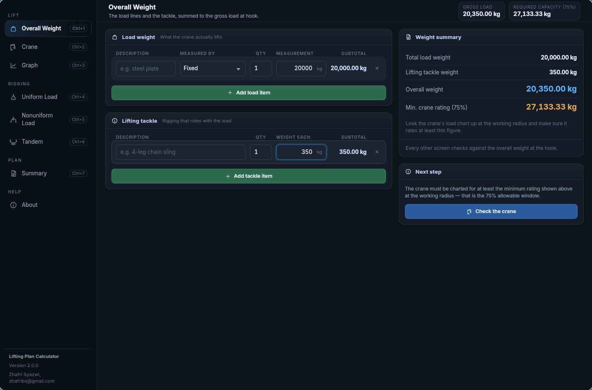
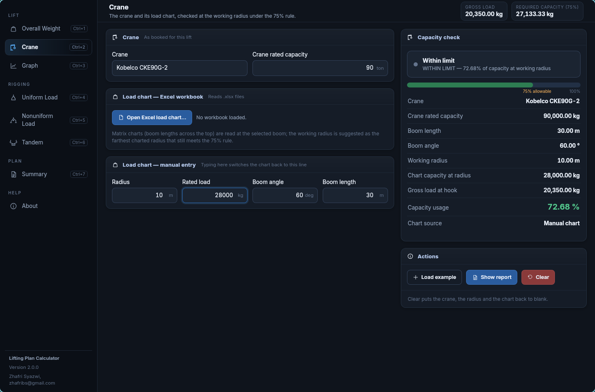
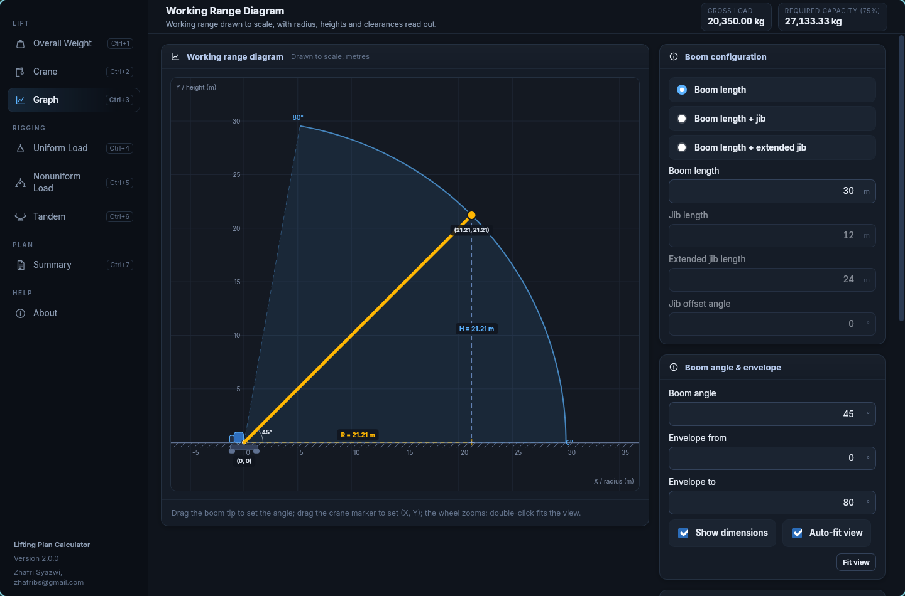
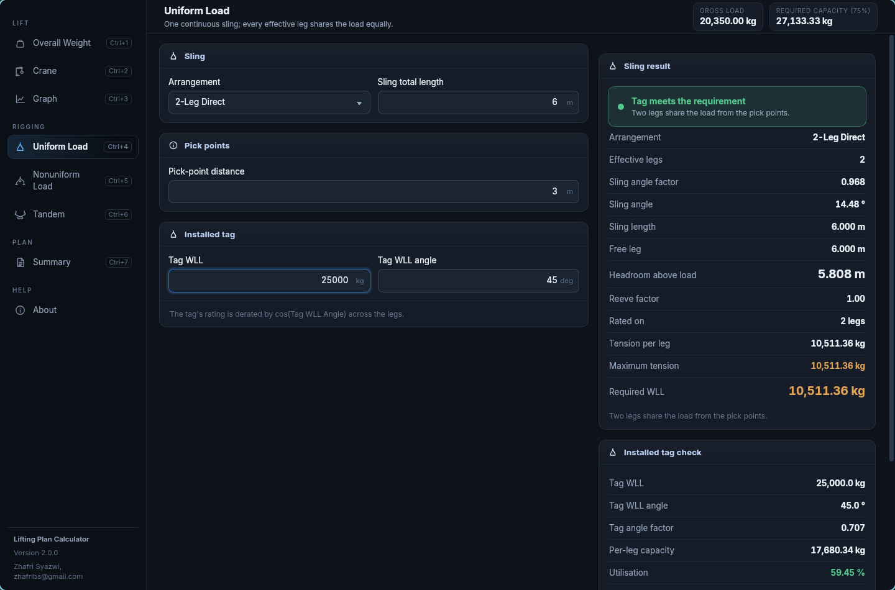
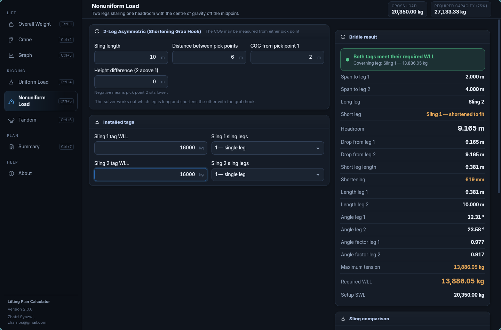
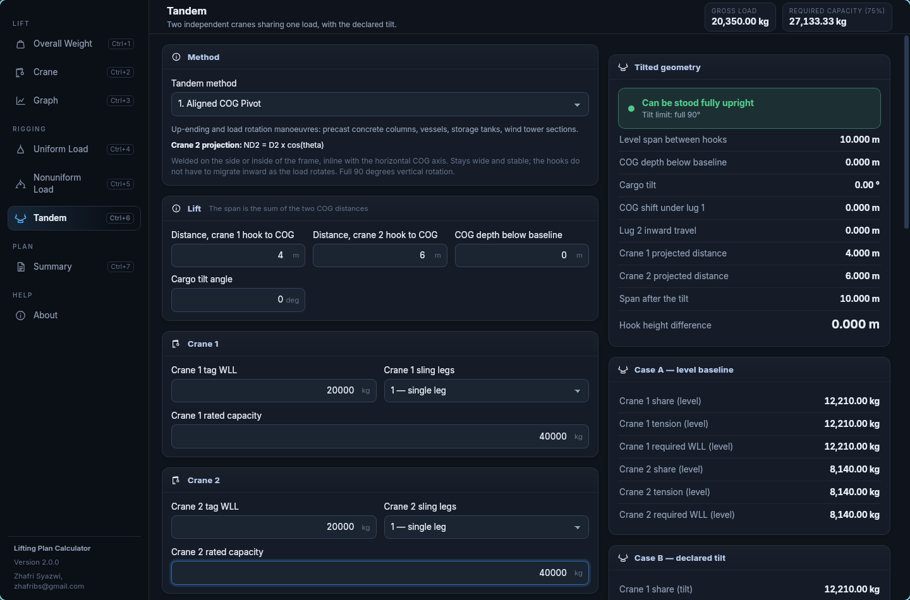
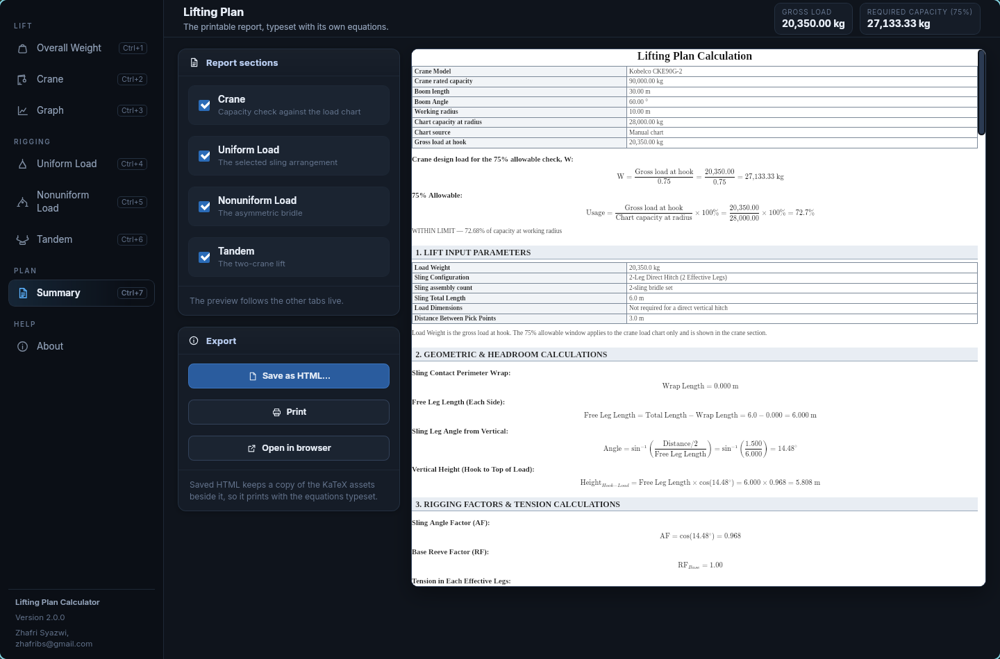

# Lifting Plan Calculator

[](https://github.com/zhafribs/lifting-plan-calculator/actions/workflows/ci.yml)
[](https://github.com/zhafribs/lifting-plan-calculator/releases/latest)
[](LICENSE)
[](#install)
[](https://www.rust-lang.org/)
[](https://tauri.app/)

A Linux desktop build of the Lifting Plan Calculator, written in Rust with a
Tauri 2 shell and shipped as a single **AppImage** — one file that runs on
Ubuntu, Fedora and Arch.

Every figure is solved by the Rust engine (ported line-for-line from the
Android Kotlin source) and covered by a test suite ported from the Kotlin unit
tests. No sign-in, no network, no stored state: all calculations run locally.



## Features

Five calculation forms over one shared lift, plus a printable report:

| Tab | What it does |
| --- | --- |
| **Overall Weight** | Load lines and tackle, summed to the gross load at the hook. |
| **Crane** | The capacity check against a load chart imported from Excel, or a single point typed by hand (max 75% of rated chart capacity). |
| **Uniform Load** | The nineteen 1-leg / 2-leg / nested / bridle arrangements, each checked against the gross load at hook. |
| **Nonuniform Load** | The 2-leg asymmetric bridle with a shortening grab hook. |
| **Tandem** | Two independent cranes sharing one load, in the two declared lug configurations. |
| **Summary** | An HTML report with KaTeX-typeset formulas, ready to save or print. Saved reports keep a copy of the KaTeX assets beside them, so they print with the equations typeset anywhere. |

## Screenshots

Every screen below is a live capture of the running app with an example lift
(20,000 kg load plus 350 kg of tackle, giving a 20,350 kg gross load and a
27,133.33 kg required capacity at the 75% rule).

| Overall Weight | Crane capacity check |
| --- | --- |
|  |  |
| **Working range diagram** | **Uniform Load** |
|  |  |
| **Nonuniform Load** | **Tandem** |
|  |  |

**Summary report** — the printable plan, with each figure shown as its formula:



## Install

### AppImage (recommended)

Download the latest `lifting-plan-calculator-V*.appimage` from the
[Releases page](https://github.com/zhafribs/lifting-plan-calculator/releases/latest),
then:

```bash
chmod +x lifting-plan-calculator-V2.1.1.appimage
./lifting-plan-calculator-V2.1.1.appimage
```

The portable release is built inside an Ubuntu 22.04 userspace, so its glibc
floor is 2.35 and it runs on **Ubuntu 22.04+, Fedora 36+ and Arch**. It bundles
the GTK 3 and WebKitGTK 4.1 stack it needs; nothing app-specific has to be
installed on the target machine. Verify it against the `SHA256SUMS.txt`
attached to the release if you like.

### From source

```bash
git clone https://github.com/zhafribs/lifting-plan-calculator.git
cd lifting-plan-calculator/src-tauri
cargo run            # debug build, opens the calculator
```

The frontend lives in `ui/` and is embedded into the binary at compile time —
there is no Node.js build step and no npm dependency.

## Building the AppImage

```bash
./build-appimage.sh            # host build: fastest, runs on distributions at
                               # least as new as the host's glibc

./build-appimage-portable.sh   # portable build: inside an Ubuntu 22.04 userspace
                               # (bubblewrap; no root needed) so the file runs on
                               # Ubuntu 22.04+, Fedora 36+ and Arch
```

Both write `dist/lifting-plan-calculator-V<version>.appimage`.

Requirements: Rust (cargo), and a system with `webkit2gtk-4.1`, `gtk3` and
`librsvg` development packages. The scripts install the Tauri CLI if missing.
`build-appimage-portable.sh` needs `bwrap` and an internet connection on its
first run (it caches a ~30 MB Ubuntu base rootfs under
`~/.cache/lifting-plan-calculator-build`). A Dockerfile with the same effect
lives in `packaging/Dockerfile` for environments where Docker is preferred.

**Why two build paths?** A host build links against the host's glibc and bundles
the host's GTK/WebKitGTK, which were themselves built against it — so an
AppImage built on a rolling-release system refuses to start on an older LTS
(`version 'GLIBC_2.44' not found`). The portable build fixes the floor at glibc
2.35, the Ubuntu 22.04 baseline.

## Tests

```bash
cd src-tauri
cargo test
```

134 tests, all ported from the Kotlin unit suite (`CalcTest`, `CraneTest`,
`CraneManualEntryTest`, `SlingTest`, `NonuniformTest`, `ExcelImportTest`,
`ReportTest`, `ReportUniformTest`, `ReportCapacityTest`,
`ReportNonuniformTest`), plus a few structural tests of the Rust port. The
expected figures are the Kotlin tests' own literals, so a drift in the
arithmetic fails the build.

The same suite runs on every push and pull request in
[CI](.github/workflows/ci.yml).

## Layout

```
src-tauri/          the Rust crate
  src/
    calc.rs         engine primitives (the 75% rule, chart lookup, bands)
    model.rs        load lines, tackle, totals
    crane.rs        the crane form and its capacity check
    sling.rs        the nineteen uniform-load arrangements
    nonuniform.rs   the asymmetric bridle and the two tandem methods
    excel.rs        xlsx load-chart reading and the import rules
    report*.rs      the HTML report builders (KaTeX equations)
    commands.rs     the Tauri command surface
    dto.rs          the wire shapes the UI talks in
  examples/         dev-only fixture dumper for UI work
  icons/            generated from the app's crane icon
ui/                 the frontend (plain ES modules; no build step)
  js/screens/       one module per screen
  vendor/katex/     bundled KaTeX (report typesetting)
build-appimage.sh            host AppImage build
build-appimage-portable.sh   Ubuntu 22.04 userspace build (widest compatibility)
packaging/Dockerfile         the same, for Docker users
```

## Desktop notes

- **Excel import**: pick a `.xlsx` load chart; both matrix charts (boom lengths
  across the top) and column charts (radius / load / boom columns) are detected
  automatically. The working radius is suggested as the farthest charted radius
  that still meets the 75% rule.
- **Printing**: the report preview is a web view; *Print* opens the system print
  dialog, and *Save as HTML* writes a portable copy. If the desktop cannot
  print from a web view, save the file and print it from a browser.
- **Data**: nothing is stored between launches by design; every run opens a
  blank sheet. Use the report's *Save as HTML* to keep a plan.
- **NVIDIA note**: WebKitGTK's DMA-BUF renderer can crash on some NVIDIA driver
  combinations before the window draws. The app detects the NVIDIA kernel
  module and falls back to the software renderer on its own; set
  `WEBKIT_DISABLE_DMABUF_RENDERER=0` to override that choice.

## Contributing

Issues and focused pull requests are welcome — see
[CONTRIBUTING.md](CONTRIBUTING.md) and the
[Code of Conduct](CODE_OF_CONDUCT.md). Security reports go through
[private advisories](SECURITY.md).

## License

Copyright (C) 2026 Zhafri Syazwi.

This program is free software: you can redistribute it and/or modify it under
the terms of the GNU General Public License as published by the Free Software
Foundation, either version 3 of the License, or (at your option) any later
version. See [LICENSE](LICENSE) for the full text.

It bundles KaTeX (MIT) and the Inter font (SIL OFL 1.1); see
[THIRD_PARTY_NOTICES.md](THIRD_PARTY_NOTICES.md).
